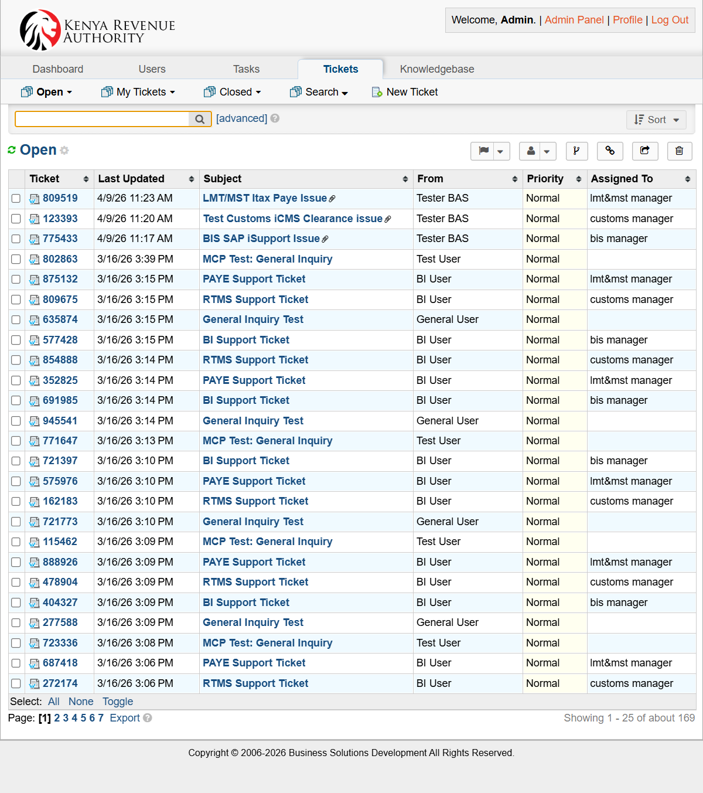
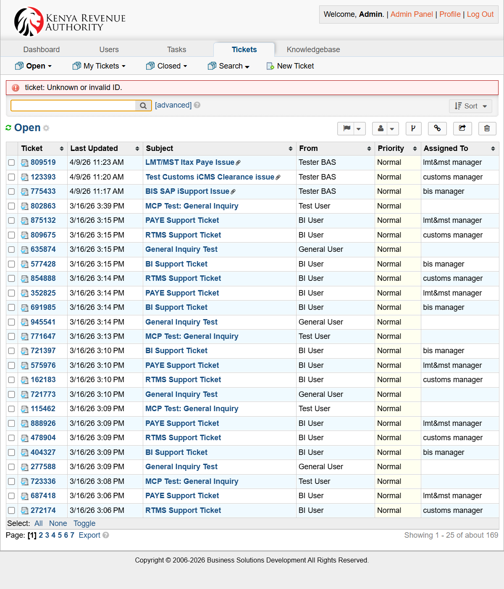

# BAS Manager Guide

This guide explains what the BAS Manager does at the intake and closure points of the workflow.

## BAS Manager responsibilities

The BAS Manager owns the business-facing control points in the flow.

You are expected to:

- Review newly submitted tickets
- Confirm the issue is routed to the correct business stream
- Assign the ticket to the appropriate support analyst
- Monitor progress against SLA expectations
- Review closure readiness after resolution
- Confirm the ticket can move to requester confirmation and final close

## Queue and ticket screens

The BAS Manager works from the same staff interface used by other internal roles, with emphasis on the queue, assignment, and status controls.

## Access and authentication note

- Staff/admin authentication is email-based in this environment.
- Ensure BAS manager accounts have permissions for assignment, transfer, and canned-response management.

## BAS Manager flow

1. Review new tickets in the **Open** queue
2. Check the **Help Topic**, subject, requester, and business impact
3. Confirm the correct business area owns the issue
4. Assign the ticket to the right support analyst
5. Ensure urgent tickets are not left idle
6. Review tickets that return after deployment and resolution
7. Confirm the requester has tested and agreed the issue is complete
8. Close or route back as needed

## Typical BAS Manager decisions

### Route to the correct team
Use the help topic and problem statement to decide the ownership path:

- **BUSINESS & INTELLIGENCE SUPPORT** → BI/BAS path
- **CUSTOMS AND BORDER CONTROL** → Customs path
- **LMT AND MST** → LMT/MST path
- **General Inquiry** → general support handling

### Assign to the right analyst
Assign to a named analyst or team member who can perform first-line investigation.

### Configure and govern canned responses

Use canned responses for controlled, repeatable communication:

- Initial acknowledgement templates
- Clarification templates (missing logs/screenshots)
- UAT handoff templates
- Closure confirmation templates

Governance tips:

- Keep responses business-friendly and concise
- Review templates monthly for outdated wording
- Restrict edit permissions to designated managers/leads

### Decide whether it is a change request
If support confirms the issue needs a code or release change, the ticket should move into the development path.

## SLA oversight

Use the ticket timestamps and queue age to make sure the issue is progressing.

### SLA reference used in this documentation

| Category | Minor | Medium | Major |
|---|---:|---:|---:|
| Service Requests | 1 Day | 1 Week | 2 Months |
| Bugs | 1 Day | 1 Week | 2 Months |
| Enhancements | 2 Weeks | 2 Months | 6 Months |
| New System* | 3 Months | 6 Months | 2 Year |

*New system SLAs should be aligned with the BSD Procedure Manual.

## Department and routing controls

As BAS Manager, periodically review:

- Help topic to department mappings
- Analyst coverage by business stream
- Escalation path for unassigned or overdue tickets

If recurring misrouting is observed, update routing rules and communicate changes to support analysts.

## Closure guidance

Before closure, confirm that:

- The ticket has been implemented or answered
- QA and UAT have completed where required
- The requester has confirmed success or no further action is needed
- The ticket thread tells the complete story

## BAS Manager checklist

- Review queue regularly
- Route by correct help topic and business stream
- Assign ownership early
- Follow up before SLA breach
- Validate closure readiness
- Maintain and review canned responses
- Validate department/help-topic routing accuracy
