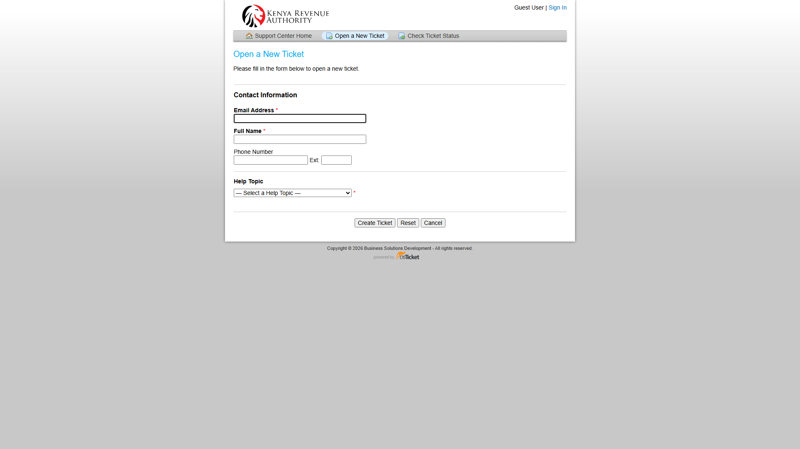
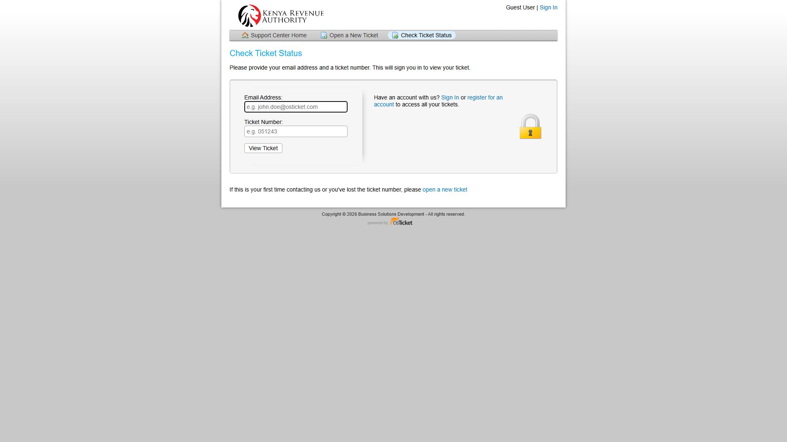

# Requester Guide

This guide shows how a requester raises a ticket, follows progress, supports testing, and confirms closure in the SmartSupport osTicket portal.

## What the requester is responsible for

As a requester, you should:

- Raise a ticket with a clear business problem statement
- Choose the correct help topic
- Provide enough detail for triage on the first submission
- Check ticket progress when updates are needed
- Participate in UAT when a fix is delivered
- Confirm whether the issue is resolved so the ticket can be closed

## Requester workflow at a glance

1. Open the Support Center
2. Select **Open a New Ticket**
3. Enter your contact details and select the correct help topic
4. Describe the issue clearly and submit the ticket
5. Keep the ticket number for follow-up
6. Use **Check Ticket Status** to track progress
7. Test the solution when support asks for confirmation
8. Confirm success so the ticket can move to **Closed**

## Support Center home

Use the portal home page to either create a new request or check the progress of an existing one.

## Open a new ticket

### What to enter

- **Email Address**: your official work email
- **Full Name**: your full name as used in business communication
- **Phone Number**: direct number or extension for urgent clarifications
- **Help Topic**: choose the business area that best matches the issue

### Before you submit

Use this quick quality check to speed up triage:

- Confirm the issue can be reproduced at least once
- Capture exact timestamp (EAT) of the latest failure
- Include identifiers (TIN, declaration number, report ID) where relevant
- Attach one screenshot that shows the full error context

### Help topic guide

| Help Topic | Use when |
|---|---|
| **BUSINESS & INTELLIGENCE SUPPORT** | Reporting, BI dashboards, SAP iSupport, analytics, or data support |
| **CUSTOMS AND BORDER CONTROL** | iCMS, customs processing, border-control workflows, or clearance issues |
| **LMT AND MST** | iTax, PAYE, LMT, MST, revenue or tax workflow issues |
| **General Inquiry** | Access requests, guidance, follow-up questions, or issues that do not fit another topic |
| **Feedback** | Suggestions, improvements, or general service feedback |

### Good problem statement example

**Subject:** iTax PAYE filing fails at submission stage  
**Business impact:** Payroll returns cannot be submitted for the April cycle  
**What happened:** Submission stops after validation and returns a generic error  
**Expected result:** PAYE return should submit and generate a confirmation number  
**Evidence to attach:** screenshot, error text, affected TIN, time of failure

## Check ticket status

To track a ticket:

1. Open **Check Ticket Status**
2. Enter the same email used during submission
3. Enter the ticket number provided by osTicket
4. Select **View Ticket**

## What the requester must do during UAT

When support or development marks a ticket as ready for validation:

- Retest the reported process in the target system
- Confirm whether the fix works end to end
- Share exact results, including screenshots if the issue persists
- Respond quickly to avoid unnecessary SLA delays

If the fix works, confirm closure. If it fails, describe what still happens and what you expected instead.

## Good requester communication examples

### Strong update

"Retested in UAT on 2026-04-13 14:20 EAT using TIN XXXXXX. Submission completed and generated confirmation ID 12345. No error observed."

### Weak update (avoid)

"Still not okay."

Always include: environment, timestamp, test steps, and observed result.

## Realistic ticket examples

| Scenario | Help Topic | Example title |
|---|---|---|
| SAP support issue | BUSINESS & INTELLIGENCE SUPPORT | SAP iSupport report not loading for finance users |
| Customs processing issue | CUSTOMS AND BORDER CONTROL | iCMS clearance search returns blank result |
| Tax workflow issue | LMT AND MST | iTax PAYE submission fails after validation |
| General service request | General Inquiry | Request access guidance for a new staff member |

## Requester checklist

- Use the correct help topic
- Describe business impact clearly
- Attach evidence where possible
- Keep the ticket number safe
- Respond to clarification requests quickly
- Confirm the outcome after testing
- Provide precise evidence (timestamp + identifier + screenshot)
