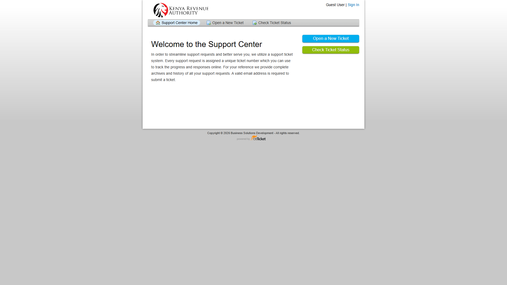
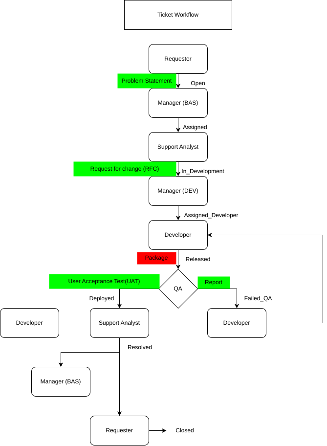

# SmartSupport osTicket Documentation

Welcome to the internal SmartSupport documentation site for the live osTicket environment hosted at `http://10.153.1.189/`.

This documentation has been aligned to the actual portal and staff screens currently available in the environment. It explains what each role is expected to do, how tickets move through the workflow, and which statuses are used during handling, development, QA, deployment, and closure.

## System overview

The SmartSupport platform is used to:

- capture service issues and support requests
- route tickets to the correct business or technical owner
- track progress across support, management, and development roles
- monitor SLA commitments
- document the full support history for each request

## Live portal entry points

- **Support Center:** `http://10.153.1.189/`
- **Open a New Ticket:** `http://10.153.1.189/open.php`
- **Check Ticket Status:** `http://10.153.1.189/view.php`
- **Staff Control Panel:** `http://10.153.1.189/scp/`

## Support Center snapshot

## Ticket lifecycle overview

The documentation follows the organization workflow shown below.

### Flow summary

1. **Requester** raises the ticket with a problem statement
2. **BAS Manager** reviews and routes the request
3. **Support Analyst** investigates and handles first-line support
4. If a change is required, the ticket becomes an RFC and moves into the development path
5. **DEV Manager** reviews and assigns technical work
6. **Developer** implements the fix and submits the release package
7. **QA** validates the package and decides whether development is complete
8. If QA fails, QA raises a failure report and returns the ticket for rework
9. If QA passes, QA initiates UAT with the requester/business representative
10. If deployment succeeds, the ticket is resolved and then closed after confirmation

## User guides

### Requester
- Raises a new ticket
- Tracks progress using email and ticket number
- Participates in UAT
- Confirms whether the issue is fully resolved

Read: [Requester Guide](Users/requester_guide.md)

### Support Analyst
- Investigates and triages assigned tickets
- Communicates with the requester
- Resolves straightforward issues or escalates to development
- Coordinates validation and marks tickets resolved

Read: [Support Analyst Guide](Users/support_analyst_guide.md)

### BAS Manager
- Reviews intake and routing
- Assigns the right analyst or business path
- Monitors SLA progress
- Confirms closure readiness

Read: [BAS Manager Guide](Users/bas_manager_guide.md)

### DEV Manager
- Reviews technical escalations
- Assigns the right developer
- Tracks implementation and QA outcome
- Decides whether work is ready for deployment

Read: [DEV Manager Guide](Users/dev_manager_guide.md)

### Developer
- Implements the technical change
- Records technical notes
- Delivers a release package for QA validation
- Supports rework when QA fails

Read: [Developer Guide](Users/developer_guide.md)

### QA
- Reviews the developer release package and build evidence
- Decides if development is complete for the submitted ticket
- Writes a QA failure report when validation fails
- Initiates/coordinates UAT when QA validation passes

Read: [QA Guide](Users/qa_guide.md)

## Ticket statuses used in the live system

The current ticket screen exposes the following workflow statuses:

| Status | Typical meaning |
|---|---|
| Open | Newly created and awaiting triage |
| Assigned | Owned by support or the next operational role |
| In Development | Approved for technical work |
| Developers Assigned | A developer has taken ownership |
| Released | Development complete and ready for validation |
| Failed QA | QA failed and rework is required |
| Deployed | Approved fix has been promoted |
| Resolved | Ticket completed from support perspective |
| Closed | Final closure after confirmation |

## SLA reference used for this guide

The SLA document provided for this project defines the following targets:

| Category | Minor | Medium | Major |
|---|---:|---:|---:|
| Service Requests | 1 Day | 1 Week | 2 Months |
| Bugs | 1 Day | 1 Week | 2 Months |
| Enhancements | 2 Weeks | 2 Months | 6 Months |
| New System* | 3 Months | 6 Months | 2 Year |

*New system SLAs should be harmonized with the BSD Procedure Manual.

## Realistic example ticket types

| Business area | Example request |
|---|---|
| BUSINESS & INTELLIGENCE SUPPORT | SAP iSupport report not loading for finance users |
| CUSTOMS AND BORDER CONTROL | iCMS clearance search returns incomplete results |
| LMT AND MST | iTax PAYE submission fails after validation |
| General Inquiry | Guidance request for new user access or service process |

## Troubleshooting and follow-up

For common user and staff issues, see the [Troubleshooting Guide](troubleshooting.md).

## Notes

- Screenshots in this documentation were captured from the live requester portal and staff interface.
- Staff screenshots were captured from the authenticated admin/staff session because named role-specific credentials were not supplied during this run.
- The workflow content is aligned to the actual statuses currently visible in the staff ticket screen.